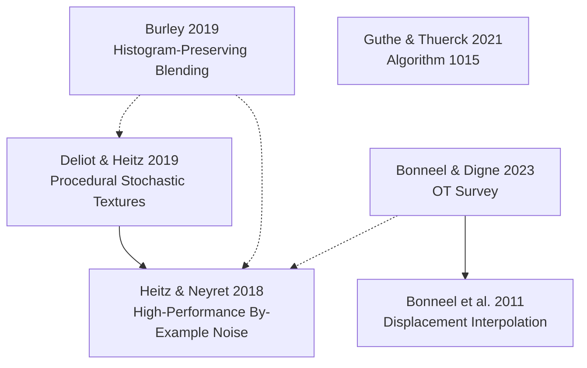

# Bibliography: Histogram-Preserving Texture Tiling and Optimal Transport

Chronological order. Each entry has a project/publisher landing page and a direct paper link where available.

## Citation graph

Solid arrow = the citing paper shares at least one author with the cited paper.  
Dotted arrow = citation with no shared author.

The graph only shows citation relationships between papers in this bibliography that I could verify. Nodes without arrows are still included because they are relevant papers discussed alongside the texture/OT work.

## 2011 — Nicolas Bonneel, Michiel van de Panne, Sylvain Paris, Wolfgang Heidrich

**Displacement Interpolation Using Lagrangian Mass Transport**

- [Landing / project page](https://www.cs.ubc.ca/labs/imager/tr/2011/DisplacementInterpolation/)
- [Paper (PDF)](https://www.cs.ubc.ca/labs/imager/tr/2011/DisplacementInterpolation/DisplacementSigAsia.pdf)
- [ACM / DOI landing](https://doi.org/10.1145/2024156.2024192)

## 2018 — Eric Heitz, Fabrice Neyret

**High-Performance By-Example Noise using a Histogram-Preserving Blending Operator**

- [Landing / project page](https://eheitzresearch.wordpress.com/722-2/)
- [Paper (PDF)](https://hal.inria.fr/hal-01824773/document)
- [DOI](https://doi.org/10.1145/3233304)

## 2019 — Thomas Deliot, Eric Heitz

**Procedural Stochastic Textures by Tiling and Blending**

- [Landing / project page](https://eheitzresearch.wordpress.com/738-2/)
- [Paper / GPU Zen 2 chapter (PDF)](https://drive.google.com/file/d/1QecekuuyWgw68HU9tg6ENfrCTCVIjm6l/view?usp=drive_open)

## 2019 — Brent Burley

**On Histogram-Preserving Blending for Randomized Texture Tiling**

- [Landing / JCGT article page](https://www.jcgt.org/published/0008/04/02/)
- [Paper — low-resolution PDF](https://www.jcgt.org/published/0008/04/02/paper-lowres.pdf)
- [Paper — full-resolution PDF](https://www.jcgt.org/published/0008/04/02/paper.pdf)

## 2021 — Stefan Guthe, Daniel Thuerck

**Algorithm 1015: A Fast Scalable Solver for the Dense Linear (Sum) Assignment Problem**

- [Landing / Fraunhofer publication page](https://publica.fraunhofer.de/entities/publication/5b53c32b-f328-4462-ae51-0368201bef71)
- [ACM / DOI landing](https://doi.org/10.1145/3442348)
- [Paper (PDF)](https://www.culip.org/assets/files/2021_guthe_lap.pdf)
- [Official CALGO implementation archive / index](https://calgo.acm.org/)

## 2023 — Nicolas Bonneel, Julie Digne

**A Survey of Optimal Transport for Computer Graphics and Computer Vision**

- [Landing / Eurographics Digital Library](https://diglib.eg.org/items/65f57f22-a70f-49ac-9337-06ef9b70348b)
- [Paper (HTML)](https://onlinelibrary.wiley.com/doi/full/10.1111/cgf.14778)
- [Paper (PDF)](https://diglib.eg.org/bitstream/handle/10.1111/cgf14778/v42i2pp439-460_cgf14778.pdf)
